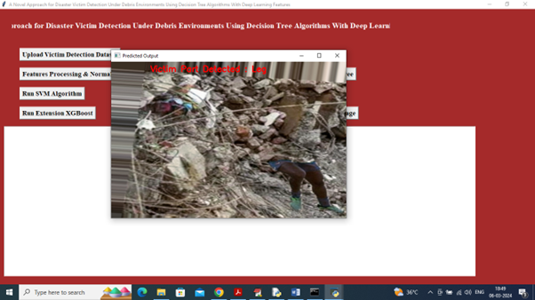

# RTRP Project - Victim Detection System

## Project Description
This project is a Python-based system designed to detect victims from images or video using computer vision techniques. The system helps in identifying human presence in disaster areas to support rescue operations.

## Features
- Image Augmentation
- Victim Detection using Computer Vision
- Python-based implementation
- Easy to run and modify

## Technologies Used
- Python
- OpenCV
- NumPy
- Machine Learning (optional)

## Project Structure
RTRP-project-python-Nikitha/
│
├── Augmentation.py
├── VictimDetection.py
├── requirements.txt
├── README.md
└── LICENSE

## Installation
Clone the repository:

git clone https://github.com/yourusername/RTRP-project-python-Nikitha.git

Install required libraries:

pip install -r requirements.txt

## Usage
Run the victim detection program:

python VictimDetection.py

## Author
Nikitha Mandala

## License
This project is licensed under the MIT License.

## 📸 Output

